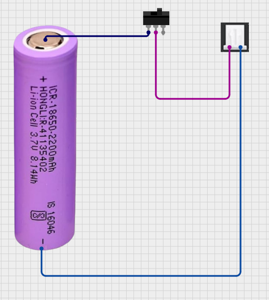
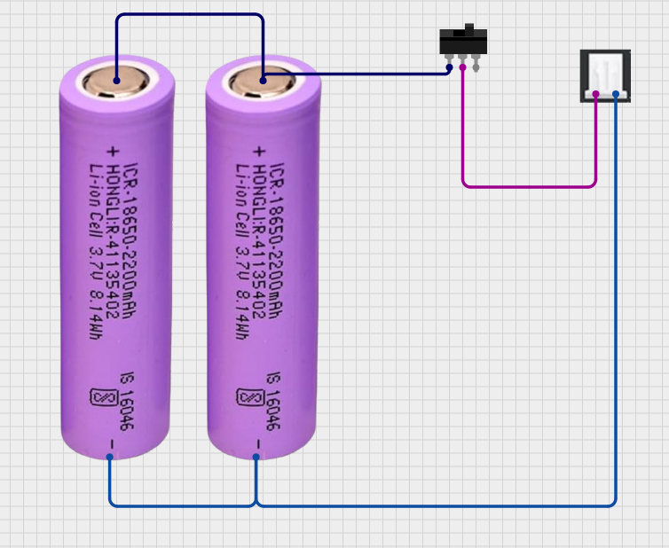

# Assembly Guide

Make sure to properly lay out each part before beginning. 

You should have:
1) Node (RAK, Heltec, etc.)
2) Antenna for LoRa (and bluetooth if applicable)
3) Battery, wiring, and power switch (if needed)
4) USB-C Cable
5) M2, 2.5, 3 screws
Tools
6) Soldering station, wire strippers
7) Small phillips screwdriver and hex
8) 3D printer

## Case Design
The Mesh Club has several options designed by members:

Several can be found on printables:

## Wiring Harness

Here's what the wiring harness would look like for an 18650 battery. The "on" position is when the two leftmost poles are connected, and the "off" is when the circuit is open, or only one is connected.

To add more capacity, wire the batteries in parallel. When they are wired in series the voltage is added.

## Peripherals

