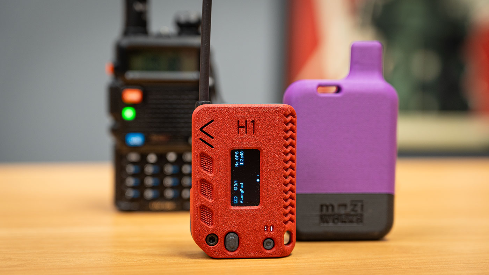

# Intro & Short Overview

## What Is Meshtastic?

[Meshtastic](https://meshtastic.org/docs/introduction/) is an open-source, decentralized communication system that uses LoRa (Long Range) radio technology to enable encrypted, low-power digital messaging between devices known as *nodes*. Nodes can take several forms, including handheld devices with integrated displays, compact Bluetooth-enabled units that interface with smartphones, or permanently installed high-power stations designed for wide-area coverage.

## Target Audience

Meshtastic is commonly used by hobbyists, outdoor enthusiasts operating beyond cellular coverage, and for emergency or resilient communications during network outages. Its decentralized architecture and low cost make it well suited as an educational platform for students.

Check out these interactive maps

- [SE Mesh Network](https://meshinfo.almesh.net/map.html)
- [Worldwide Mesh Map](https://meshmap.net/)

## Why Get Involved?

Building a Meshtastic node offers a hands-on introduction to microcontrollers, radio frequency (RF), and even 3D printing. Whether you're just getting started or already have experience, this project provides practical exposure to hardware configuration, firmware flashing, RF principles, filters, and antennas.
