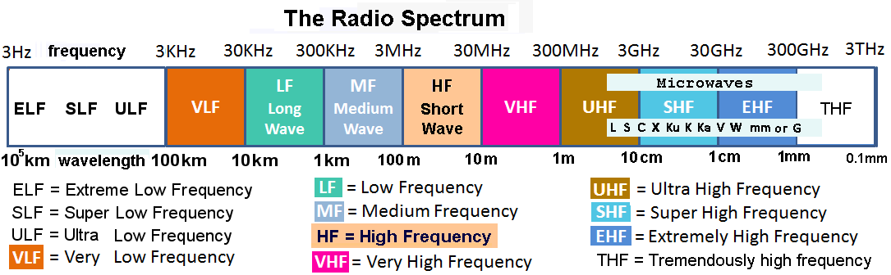
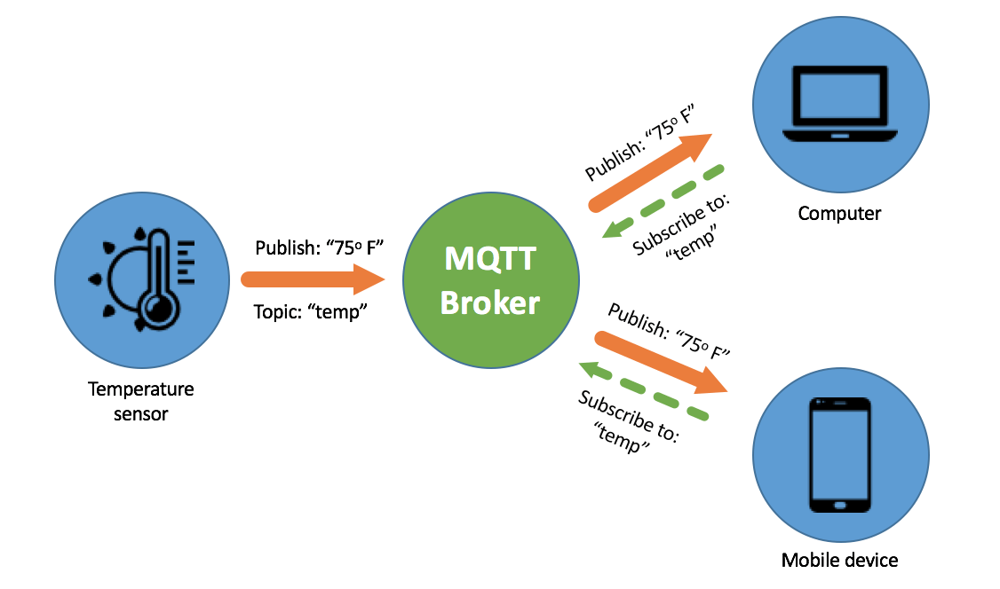

# Meshtastic Protocol

## ISM Band and RF Overview

In North America, Meshtastic operates in the unlicensed **915 MHz [ISM band](https://en.wikipedia.org/wiki/ISM_radio_band)**. LoRa modulation enables long-range communication at very low power levels by trading data rate for sensitivity and range. Payload sizes are typically limited to **256 bytes per message**.

The maximum permitted effective isotropic radiated power ([EIRP](https://en.wikipedia.org/wiki/Effective_radiated_power)) in this band is **+30 dBm (1 W PEP)**, or **+36 dBm EIRP** when accounting for antenna gain. Operating outside of these limits is strictly prohibited by the [FCC](https://docs.fcc.gov/public/attachments/FCC-02-151A1.pdf).

Meshtastic supports multiple radio presets, ranging from short-range, high-bandwidth modes to long-range, low-bandwidth configurations. The most commonly used open-channel preset is **Long / Fast** (1.07 kbps, 250 kHz), which balances throughput and coverage and is the default configuration.

## Network
Nodes form a **self-healing mesh network** by rebroadcasting messages. A configurable hop limit controls how many times a packet may be relayed, allowing the network to scale while limiting congestion and signal degradation.

## Encryption

Channels such as *LongFast* are encrypted using [**AES-256 (CTR mode)**](../encryption/encryption.md) with a pre-shared channel key. Direct messages use public/private key pairs for end-to-end encryption. Messages are cryptographically signed, allowing recipients to verify the sender's identity. Packet headers remain unencrypted to support routing and rebroadcasting. 

## MQTT

Optionally, Meshtastic supports **MQTT bridging** -- [a lightweight publish-subscribe machine-to-machine networking protocol](https://en.wikipedia.org/wiki/MQTT), which tunnels mesh traffic over the internet. This allows geographically separated mesh networks to interconnect, at the cost of relying on grid infrastructure.

